# RadioLunaDiff: A Physics Informed NN Architecture for Predicting Radio Maps over Lunar Terrain

This repo contains the work relating to our paper [Radiolunadiff: Estimation of wireless network signal strength in lunar terrain](https://www.arxiv.org/abs/2509.14559)

Check out the [Website!](https://radiolunadiff.github.io/)

NOTE: This repository is not complete.


## Features

- RadioLunaDiff is a triplet-UNet architecture model designed to predict radio maps over lunar terrain
- Utilizes a PINN architecture implemented by initially predicting a squared wavenumber (or $k^2$) map
- Utilizes Diffusion to create high-detail radio map predictions

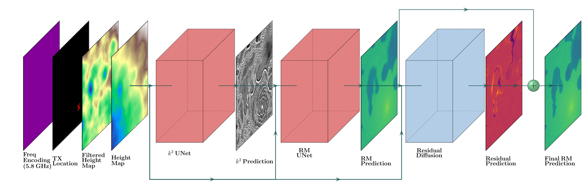

## Installation

```bash
git clone https://github.com/anderspearson206/lunadiff.git
cd lunanet
pip install -r requirements.txt
```
Note: PyTorch installation may differ based on your machine, please refer to [PyTorch Installation Guide](https://pytorch.org/get-started/locally/)


## Dataset

The dataset features lunar terrain height maps generated with a custom [Lunar Terrain Generator](https://github.com/anderspearson206/LunarTerrainGenerator).

**Lunar Terrain Examples:**

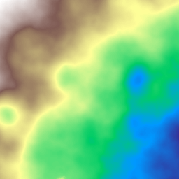 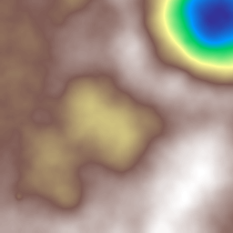

Terrain is also filtered using a high-pass filter and used as a second input.

**Filtered Lunar Terrain Examples**

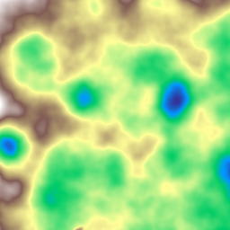 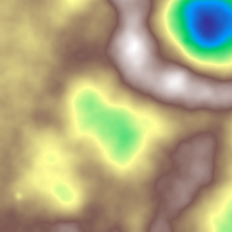

Radio maps for the dataset are generated using [Sionna-RT](https://nvlabs.github.io/sionna/rt/index.html) at 415 MHz and 5.8 GHz, with interpolation being used to complete any missing pixels.

**Radio Map Examples at 415 MHz**

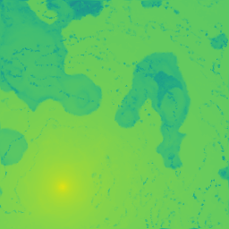 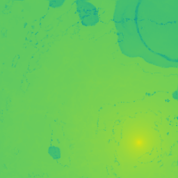

**Radio Map Examples at 5.8 GHz**

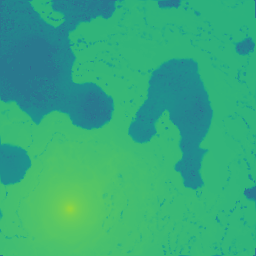 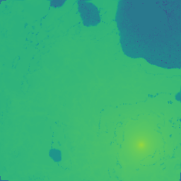

Additionally, transmitter locations and frequency are encoded as one-hot images and single value binary images, respectively.

## Usage

To use this repo, first clone and install the required packeges:

```bash
python train_first_UNet.py
```


The full model needs to be trained in three steps. The first UNet is trained to predict the binary $k^2$ maps:

```bash
python train_first_UNet.py
```

The second UNet is trained to predict the Radio Map:

```bash
python train_second_UNet.py
```

The final model is a DDPM model trained to predict the residual between the 2nd stage prediction and the target map, which is then used to reconstruct a final prediction:

```bash
python train_residual_diffusion.py
```

Each stage can be tested with:

```bash
python test_first_UNet.py
python test_second_UNet.py
python test_full_model.py
```

These tests will test MSE, NMSE, SSIM, and PSNR, as well as output example images.

**Example Images from test_full_model.py**

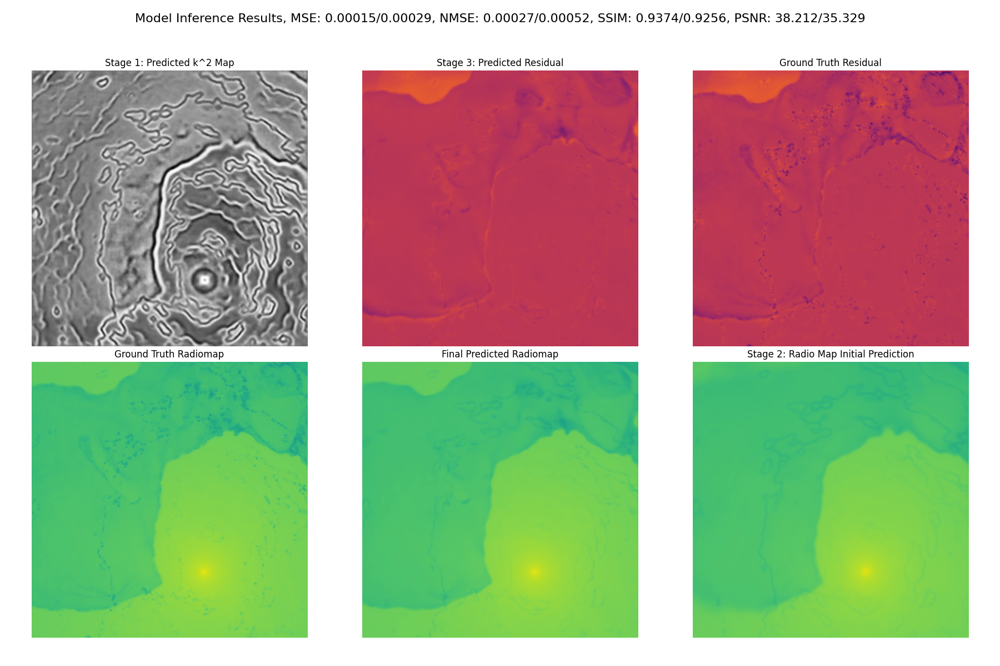

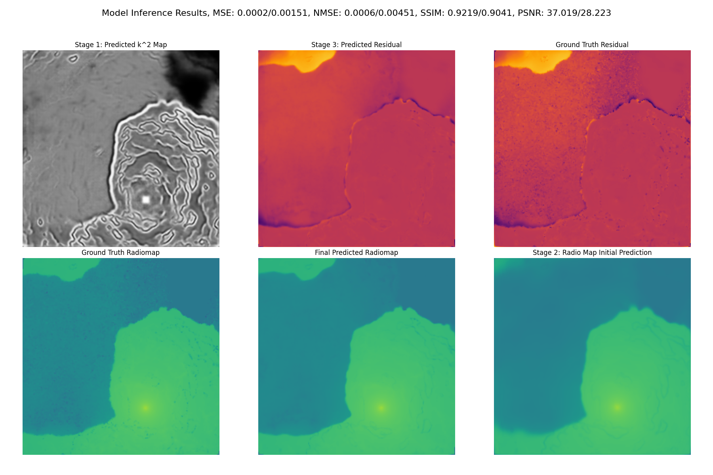

## Citation 

```bash
@misc{torrado2025radiolunadiffestimationwirelessnetwork,
      title={Radiolunadiff: Estimation of wireless network signal strength in lunar terrain}, 
      author={Paolo Torrado and Anders Pearson and Jason Klein and Alexander Moscibroda and Joshua Smith},
      year={2025},
      eprint={2509.14559},
      archivePrefix={arXiv},
      primaryClass={eess.SP},
      url={https://arxiv.org/abs/2509.14559}, 
}
```

## License

This project is licensed under the [MIT License](LICENSE).

## Contact

For questions or support, contact [amp206@uw.edu].